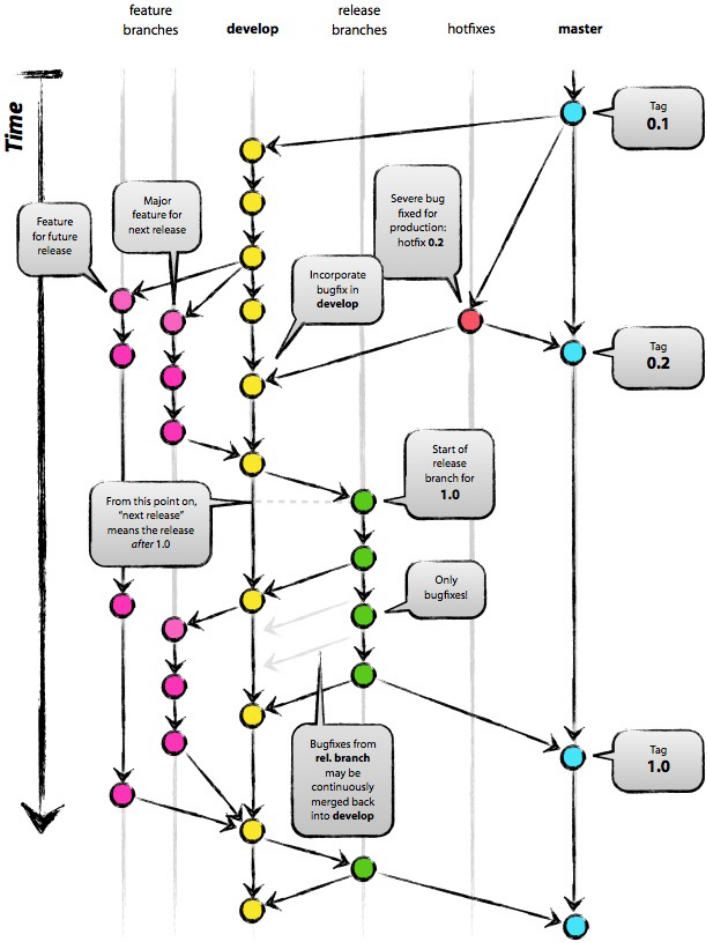

本文作为 Git 简明指南，简单介绍了 Git 工作流和 Git 内部实现原理，然后介绍了 Git 常用的配置，列举了 Git 常用的命令。最后，介绍了经典的 Git 分支管理流程。

<!--more-->

## Git 工作流

你的本地仓库由 git 维护的三棵“树”组成。第一个是你的工作目录（workspace），它持有实际文件；第二个是暂存区（Index），它像个缓存区域，临时保存你的改动；最后是 HEAD，它指向你最后一次提交的结果。


git 状态的转换如下图所示：


## Git 内部实现原理

Git 是一个内容寻址文件系统。

Git 的核心部分是一个简单的键值对数据库（key-value data store）。 你可以向该数据库插入任意类型的内容，它会返回一个键值，通过该键值可以在任意时刻再次检索（retrieve）该内容。

每一次提交对应 .git/objects 目录下的一个文件。以该内容加上特定头部信息一起的 SHA-1 校验和为文件命名。 校验和的前两个字符用于命名子目录，余下的 38 个字符则用作文件名。

所有的提交以树的方式组织在一起。

HEAD, master, 分支名，标记，都是一个指针指向某一次提交。

## Git 配置

了解以上 Git 工作流和 Git 内部实现原理，有助于更好的使用 Git。为了更好的使用 Git，需要对 Git 进行一些简单的配置。

查看当前配置的命令：

```
git config --lis
```

设置提交用户名和邮箱：

```
git config --global user.name "username"
git config --global user.email "mail@gmail.com"
```

设置所有的 git pull 命令使用 git rebase 而不是 git merge：

```
git config --global pull.rebase true
```

设置别名：

```
alias.st=status
alias.br=branch
alias.unstage=reset HEAD
alias.last=log -1
alias.lg=log --color --graph --pretty=format:'%Cred%h%Creset -%C(yellow)%d%Creset %s %Cgreen(%cr) %C(bold blue)<%an>%Creset' --abbrev-commit
alias.co=checkout
alias.cm=commit -m
```

其他配置：

```
color.ui=true
core.quotepath=false
core.autocrlf=input
```

生成 SSH Key：

```
ssh-keygen -t rsa -C ""
```

完成后，默认保存位置当前用户名下/.ssh/id_rsa 和 id_rsa.pub，分别是私钥和公钥，可以把公钥添加到远端代码托管平台，这样在使用 Git 时就不用输入密码了。

GitHub 可以在 `设置 -> SSH and GPG Keys` 添加 SSH Key。

## Git 常用命令

### 创建本地仓库

```
git init                # 创建本地仓库
git clone <server>      # 克隆远程仓库到本地
```

### 添加 & 删除

```
git add <filename>              # 添加文件到暂存区
git add .                       # 添加所有修改到暂存区
git rm <filename>               # 直接删除文件
git rm --cached <filename>      # 将文件从暂存区移除
```

### 提交

```
git commit -m "commit message"      # 提交修改
git cherry-pick <commit>...         # 把指定 commit 合并到当前分支，会生成新的 commit
```

### 远程仓库

```
git remote add origin <server>     # 添加远程仓库
git remote -v                      # 查看远程仓库
git push origin master             # 推送到远程 master 分支
git pull origin master             # 从远程仓库拉取更新
```

### 分支管理

```
git branch <branch>                         # 创建分支
git checkout <branch>                       # 切换分支
git checkout -b <branch>                    # 创建并切换到新分支
git checkout -b <branch> <commit>           # 基于某个版本创建新分支
git checkout -b <branch> origin/<branch>    # 创建远程分支到本地
git branch -d <branch>                      # 删除本地分支
git push origin :<branch>                   # 删除远程分支（推送一个空分支到远程分支）
git push origin <branch>                    # 推送本地分支到远程仓库
git merge <branch>                          # 合并分支
git rebase <branch>                         # 分支衍合
git branch --set-upstream <branch> origin/<branch>      # 建立起本地分支和远程分支的关联，之后可以直接git pull从远程抓取分支
git fetch -p        # 删除远程分支后本地分支同步
```

### 标记管理

```
git tag <tagName>               # 基于当前 HEAD 创建标记
git tag <tagName> <commit>      # 基于指定的 commit id 创建标记
git tag -a <tagName> -m 'msg'   # 创建带注释的标记
git checkout <tagName>          # 切换到标记
git push origin <tagName>       # 推送标记到远程仓库
git tag -d <tagName>            # 删除本地标记
git push origin :<tagName>      # 删除远程标记
git tag -l -n1                  # 查看标记列表
```

### 查看历史

```
git log             # 查看提交历史
git show <commit>   # 查看某次修改
```

### 版本回退

```
git status                      # 查看工作区、暂存区的状态
git clean -fd                   # 删除 untracked files
git checkout -- <file>          # 丢弃工作区上某个文件的修改
git checkout <commit> <file>    # 将某个文件的历史版本 checkout 到工作区
git reset HEAD <file>           # 丢弃暂存区上某个文件的修改，重新放回工作区
git reset --hard <commit>       # 版本回退
git reflog                      # 查看命令历史，常用于帮助找回丢失掉的commit
```

### 查看差异

```
git diff              # 查看工作目录和暂存区之间的不同，「如果你现在把所有文件都 add，你会向暂存区中增加哪些内容」
git diff --cached     # 查看暂存区和上一条提交之间的不同，「如果你立即输入 git commit，你将会提交什么」
git diff HEAD         # 查看工作目录和上一条提交之间的不同，是上面两个的内容相加，「如果你现在把所有文件都 add 然后 git commit，你将会提交什么」
git diff HEAD -- <file>                     # 查看工作区和版本库里面最新版本的区别
git diff <commit1> <commit2> --name-only    # 比较两次提交的差异文件列表
git diff <commit1> <commit2> --name-only | xargs zip update.zip          #  比较两次提交的差异，并将所有差异的文件打成一个 zip 包
git diff <source_branch> <target_branch>    # 在合并改动之前，预览两个分支的差异
```

### 储藏和恢复

```
git stash           # 把当前分支所有没提交的代码储藏起来
git stash pop       # 恢复工作现场，并删除stash内容
git stash list      # 查看储藏的工作现场
git stash apply     # 恢复工作现场，stash内容并不删除
```

## Git 分支管理流程



### master 分支

master 分支对应当前生产代码，严禁直接在这个分支上进行开发和提交。

### develop 分支

* develop 分支基于 master 分支创建。
* 对应开发主分支，只用于做代码同步，不能直接在这个分支进行开发和提交。

### feature 分支

* feature 分支基于 develop 分支创建。
* feature 分支用于新功能的开发、bug 修复等日常开发。
* 使用 git rebase develop 命令及时合并 develop 分支最新代码，防止和 develop 分支越走越远。
* 当合并 develop 分支有冲突时，在 feature 分支进行解决。
* feature 分支开发完成后被合并到 develop 分支。

### release 分支

* release 分支基于 develop 分支创建。
* release 分支作为待发布分支，在这个分支进行回归测试和测试问题的修复。
* release 分支开发完成后被合并到 develop 和 master 分支。

### hotfix 分支

* hotfix 分支基于 master 分支创建。
* hotfix 分支用于生产问题的紧急修复。
* hotfix 分支开发完成后被合并到 develop 和 master 分支。

## 代码提交规范

* 不在 dev 开发主分支上直接做提交。
* 基于 dev 分支创建本地 feature 分支进行提交，包括新功能的开发、bug 修复等。
* 每天从服务端拉取 dev 分支最新代码。
* 在本地 feature 分支使用 `git rebase dev` 命令及时合并 dev 分支最新代码，防止本地分支和 dev 分支越走越远。当合并有冲突时，在本地 feature 分支进行解决
* 提交代码之前先在本地进行测试，确保项目能编译通过，且能够正常运行，不可盲目提交。
* 提交必须要有注释，简要说明本次提交内容。
* 尽量提交原子级的操作，便于恢复。不要一次提交 N 多个文件，然后注释写很长还分好几点，如果是这种情况，建议分成多次提交。
